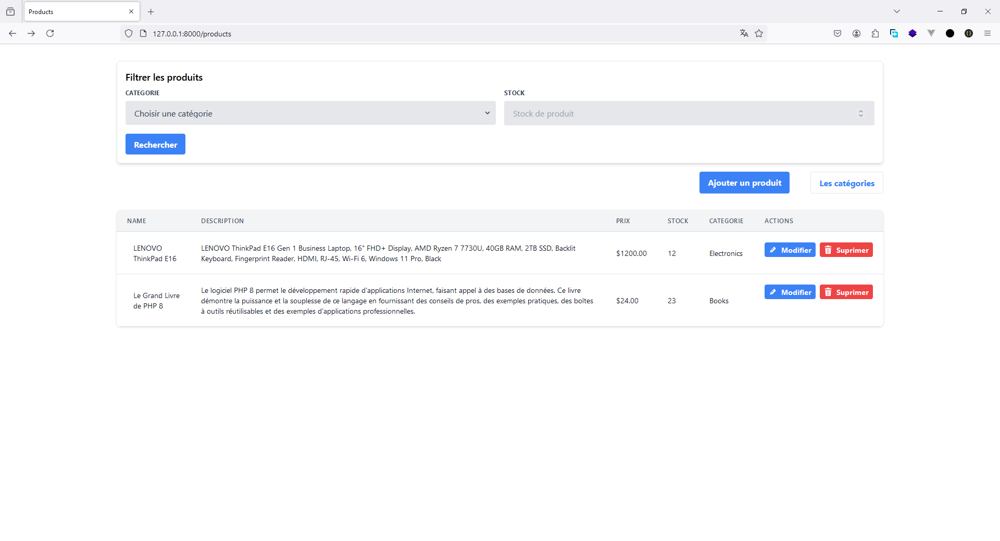
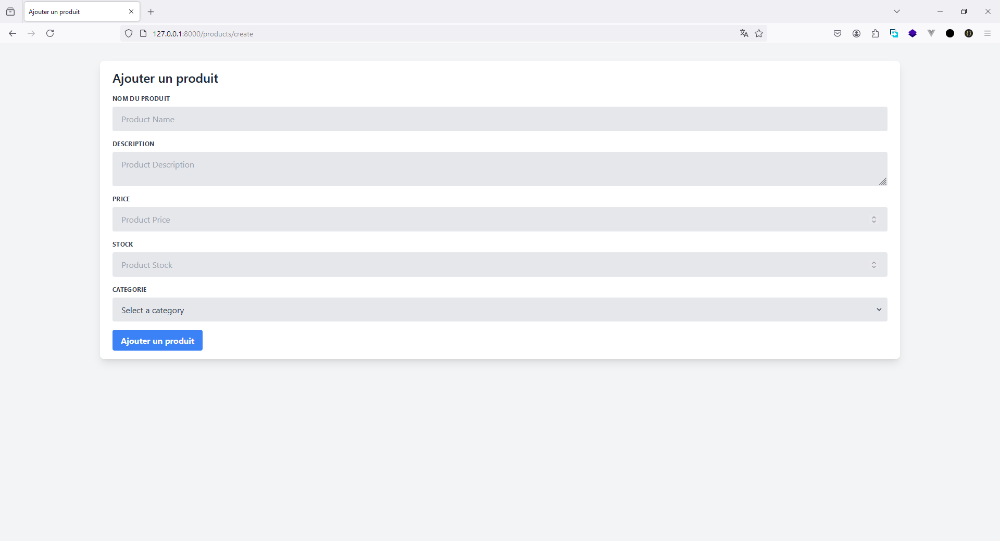
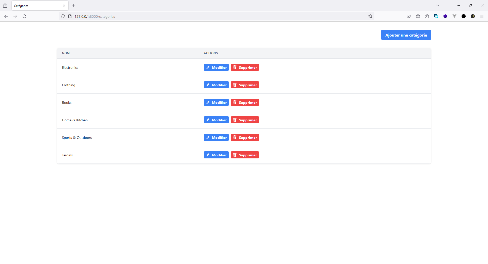
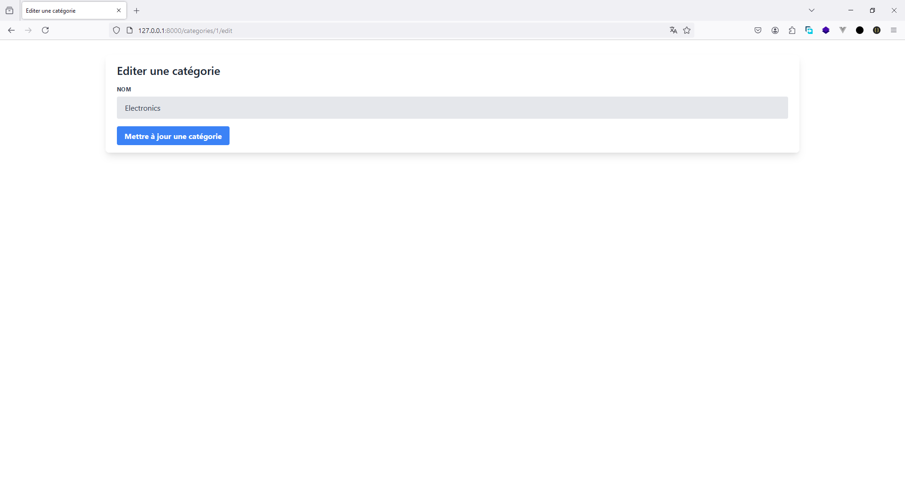
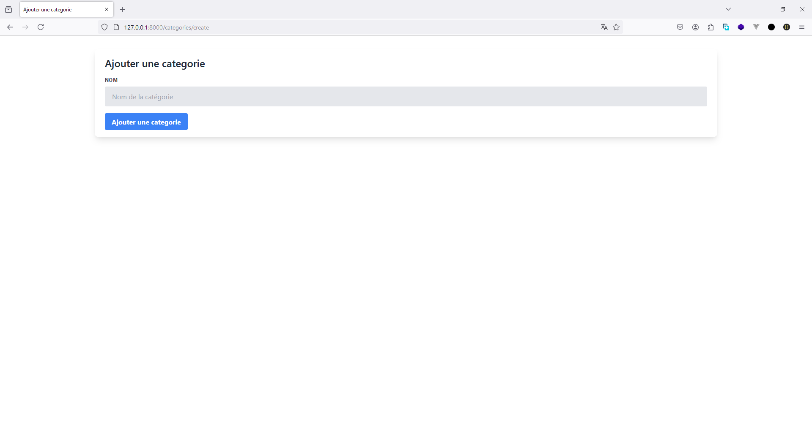

# Gestion de Produits E-commerce

Ce projet développe la partie back-office d'un site e-commerce en utilisant Laravel. L'application permet de gérer les produits et les catégories, ainsi que leur stock, et offre une interface utilisateur pour toutes les opérations CRUD (Create, Read, Update, Delete).

## Capture d'écran des interfaces

